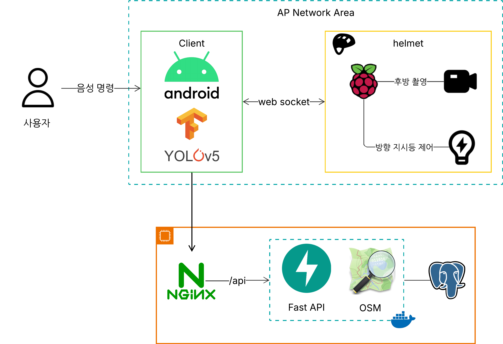

# 🚲 HelpMet – 핸즈프리 따릉이 라이딩 솔루션

> 서울시 공유 자전거 ‘따릉이’를 **더 안전하고, 더 똑똑하게** 탈 수 있도록  
> 스마트 헬멧과 앱을 결합한 핸즈프리 라이딩 솔루션입니다.

---

## 📌 프로젝트 개요

HelpMet은 자전거 주행 중 발생할 수 있는 **후방 시야 확보 문제**,  
그리고 **1시간 단위 반납 시스템으로 인한 스트레스**를 동시에 해결하는  
스마트 자전거 헬멧 & 안드로이드 앱 기반 통합 서비스입니다.

---

## 💡 기획 배경

- 따릉이의 **무제한 이용 시스템**은 1시간마다 반납만 잘 하면 매우 유용합니다.
- 하지만 실제 사용자는 **남은 시간 확인 / 대여소 검색 / 주행 중 스마트폰 조작**으로 인해 스트레스를 받습니다.
- 특히 후방을 확인하려 고개를 돌릴 때 **전방 시야를 놓쳐 사고가 발생하는 문제**도 큽니다.

---

## 🧩 주요 기능

| 기능 | 설명 |
|------|------|
| 🗺️ **시간 기반 경로 추천** | 대여 시간 내 자전거도로 중심 최적 경로 안내 |
| 🎙️ **음성 기반 내비게이션** | 핸즈프리 길안내 + 목적지 음성 변경 (대여소/화장실 등) |
| 📷 **후방 객체 감지** | 헬멧 후방 카메라 + AI 탐지로 차량·보행자 인식 |
| 💡 **스마트 방향지시등** | 음성 명령으로 좌우등 제어, 회전 감지 시 자동 꺼짐 |
| 🔗 **근거리 네트워크 구성** | 외부 와이파이 없이도 헬멧과 앱 간 직접 연결 (AP 모드) |

---

## ⚙️ 기술 스택

| 구성 | 기술 |
|------|------|
| 👨‍💻 Frontend | Kotlin, Jetpack Compose, Android SensorManager, WebRTC, KakaoMap SDK |
| 🧠 AI 모델 | YOLOv5 → TensorFlow Lite 변환 (온디바이스 객체 감지) |
| 🔌 Backend | FastAPI (Python 3.11), PostgreSQL + PostGIS, OSMNx, NetworkX |
| 🔧 IoT Device | Raspberry Pi 4, AP Mode, WebSocket, GPIO 제어 |
| ⚙️ DevOps | Docker, Jenkins |

---

## 🧪 시스템 구조

## 📊 기대 효과

- ✅ 자전거 사고 위험 요소 제거 (후방 미확인, 스마트폰 조작 등)
- ✅ 따릉이 반납 스트레스 해소
- ✅ 교통약자도 쉽게 접근 가능한 공공 자전거 환경 조성
- ✅ 스마트시티 교통 인프라와의 확장성 확보

